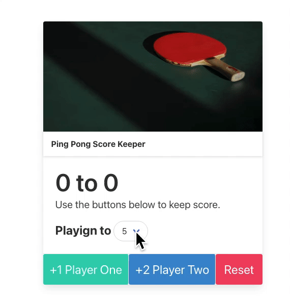

# Ping Pong Game

A simple interactive game built with vanilla JS. By building this project, I was able to understand how to manipulate DOM, create reusuable fuctions, and experience various web APIs.

## 🛠 Skills

HTML5, Bulma, JavaScript

## Acknowledgements

- [Bulma](https://bulma.io/)

## Lessons Learned

- document.querySelector
- functions
- addEventListener(change, click)
- classList.add / classList.remove
- +string => number
- using external libraries (Bulma)

## Demo

